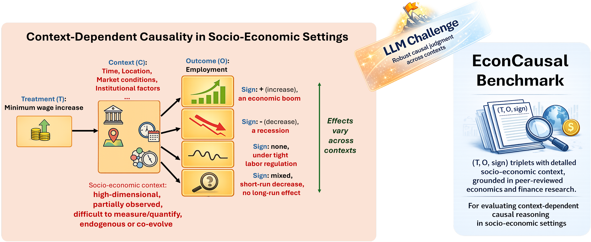
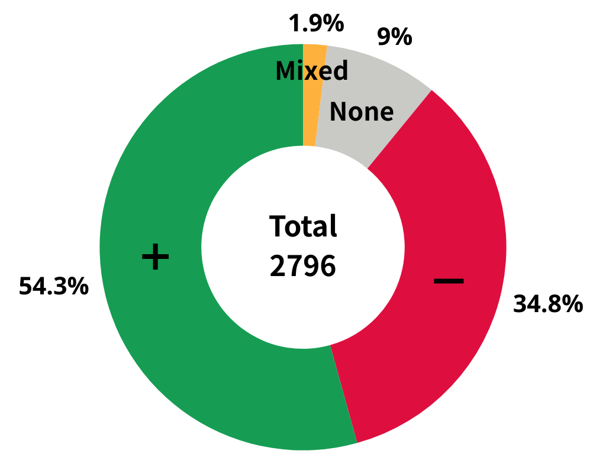
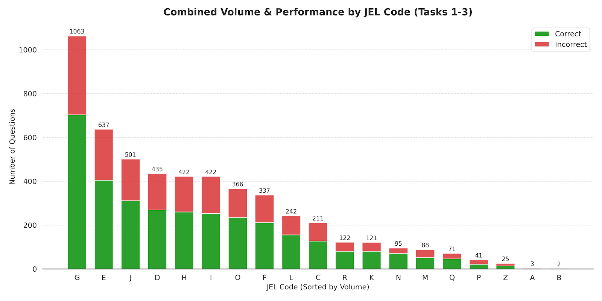
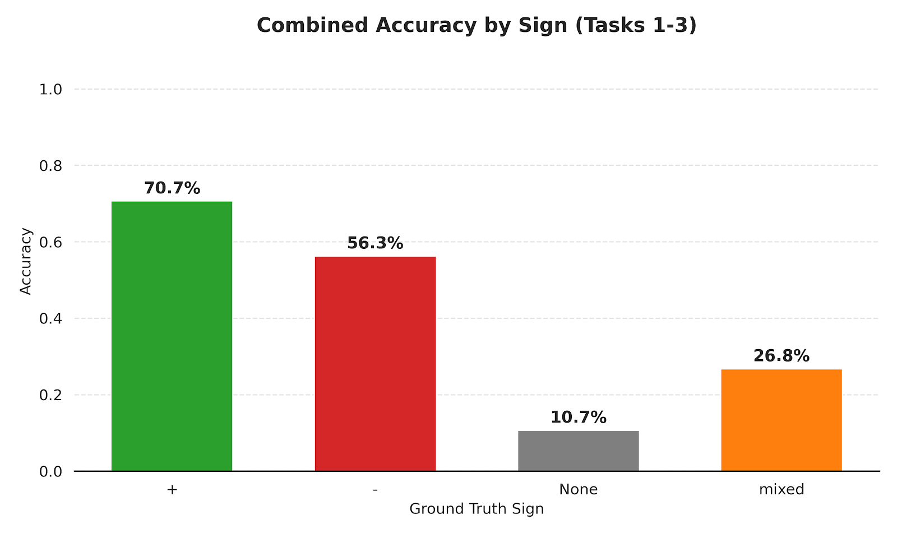

<h1 align="center">EconCausal: A Context-Aware Causal Reasoning Benchmark for Large Language Models</h1>

<p align="center">
  <b>Donggyu Lee<sup>1</sup>, Hyeok Yun<sup>2</sup>, Meeyoung Cha<sup>3</sup>, Sungwon Park<sup>4*</sup>, Sangyoon Park<sup>5</sup>, Jihee Kim<sup>2*</sup></b>
</p>

<p align="center">
  <sup>1</sup>Graduate School of Data Science, KAIST &nbsp;
  <sup>2</sup>College of Business, KAIST &nbsp;
  <sup>3</sup>MPI-SP, Germany<br>
  <sup>4</sup>School of Computing, KAIST &nbsp;
  <sup>5</sup>Division of Social Science, HKUST
</p>

<p align="center">
  <a href=""></a>
  <a href="https://github.com/econaikaist/econcausal-benchmark"></a>
  <a href="#license"></a>
</p>

---

## Overview

Socio-economic causal effects depend heavily on their specific institutional and environmental context. A single intervention can produce opposite results depending on regulatory or market factors. This poses a significant challenge for LLMs in decision-support roles: **can they distinguish structural causal mechanisms from surface-level correlations when the context changes?**

**EconCausal** is a large-scale benchmark comprising **10,490 context-annotated causal triplets** extracted from **2,595 high-quality empirical studies** published in top-tier economics and finance journals. Through a rigorous four-stage pipeline combining multi-run consensus, context refinement, and multi-critic filtering, each claim is grounded in peer-reviewed research with explicit identification strategies.

<p align="center">
  
</p>

### Key Findings

- Top models achieve ~88% accuracy in fixed, explicit contexts
- Performance **drops 32.6 pp** under context shifts (Task 2)
- Performance **collapses to 37%** when misinformation is introduced (Task 3)
- Models achieve only **9.5% accuracy** on null effects, exposing a fundamental gap between pattern matching and genuine causal reasoning

---

## Dataset

### Data Statistics

| Statistic | Value |
|---|---|
| Total causal triplets | 10,490 |
| Source papers | 2,595 |
| Publication years | 1991 -- 2025 |
| Economics journals | 5 (AER, QJE, JPE, ReStud, ECMA) |
| Finance journals | 3 (JFE, JF, RFS) |
| Domain split | Economics 67.7% / Finance 32.3% |

### Ground-Truth Sign Distribution

| Sign | Count | Percentage | Description |
|---|---|---|---|
| + | 5,841 | 55.7% | Treatment significantly increases outcome |
| - | 3,402 | 32.4% | Treatment significantly decreases outcome |
| None | 1,056 | 10.1% | No statistically significant effect |
| Mixed | 191 | 1.8% | Heterogeneous effects across subgroups |

<p align="center">
  
</p>

### Topical Diversity

The dataset spans the full breadth of economics and finance, covering all JEL classification codes from Financial Economics (G) and Macroeconomics (E) to Labor Economics (J), Public Economics (H), and Development (O).

<p align="center">
  
</p>

### Data Format

Each causal triplet includes:

| Field | Description |
|---|---|
| `treatment` | Independent variable / intervention |
| `outcome` | Dependent variable / affected endpoint |
| `sign` | Direction of causal effect (`+`, `-`, `None`, `mixed`) |
| `final_context` | Institutional and environmental context (max 100 words) |
| `final_id_methods` | Identification strategies (DiD, IV, RCT, RDD, etc.) |
| `score_sum` | Aggregate quality score from multi-critic evaluation (0-18) |
| Paper metadata | Title, authors, year, venue, JEL codes, paper URL |

---

## Construction Pipeline

EconCausal is constructed through a **four-stage LLM-based extraction and filtering pipeline** yielding high-precision annotations.

<p align="center">
  
</p>

### Step 1: Triplet Extraction with Multi-Run Consensus

- Run the LLM three independent times per paper
- Retain treatment-outcome pairs appearing in >= 2 of 3 runs
- Merge pairs with minor wording differences using cosine similarity (threshold: 0.8)
- Assign signs by majority vote; store up to three supporting evidence paragraphs verbatim

### Step 2: Paper-Level Metadata & Global Context

- Classify papers as empirical vs. theoretical
- Generate a concise global context paragraph (When/Where/Who/Background, max 100 words)
- Identify and deduplicate identification methods (DiD, IV, RDD, RCT, etc.)

### Step 3: Triplet-Specific Context Refinement

- Verify whether the global context applies at the individual claim level
- Apply minimum-edit adjustments only when the paper explicitly shows differences
- Retain global defaults unchanged when no evidence-based mismatch is found

### Step 4: Multi-Critic Evaluation & Conservative Filtering

- Three independent critic models score each triplet on **6 quality dimensions** (0-3 rubric):
  1. Variable extraction quality
  2. Causal direction accuracy
  3. Sign correctness
  4. Causality (causal vs. correlational)
  5. Main-claim centrality
  6. Context appropriateness
- Remove triplets if any dimension score < 2 or total score <= 15
- Filtering removes **27.3%** of candidate triplets

### Expert Validation

- Three economics professors assessed 206 triplets within their expertise
- Pipeline achieves **73.8% accept/reject agreement** with human experts
- Per-dimension Mean Absolute Error: **0.229**

---

## Benchmark Tasks

EconCausal includes three progressively challenging evaluation tasks probing context-dependent causal reasoning.

### Task 1: Causal Sign Identification (1,887 instances)

Given a context and a treatment-outcome pair, predict the causal sign. Tests whether LLMs can internalize economic causalities from peer-reviewed research.

### Task 2: Context-Dependent Sign Prediction (284 instances)

Given a known causal effect under context c1, predict the sign of the same treatment-outcome pair under a different context c2. Tests whether LLMs understand that causality is context-dependent.

### Task 3: Misinformation-Robust Sign Prediction (852 instances)

Same as Task 2, but with deliberately incorrect sign information. Tests whether LLMs can discount misinformation and perform robust, context-grounded reasoning.

<p align="center">
  
</p>

---

## Repository Structure

```
econcausal-benchmark/
├── data/
│   ├── causal_triplets/          # Full dataset of 10,490 causal triplets
│   │   ├── causal_triplets.csv
│   │   └── causal_triplets.jsonl
│   ├── tasks/                    # Benchmark evaluation tasks
│   │   ├── task1.csv / task1.jsonl   # Causal Sign Identification
│   │   ├── task2.csv / task2.jsonl   # Context-Dependent Sign Prediction
│   │   └── task3.csv / task3.jsonl   # Misinformation-Robust Sign Prediction
│   └── metadata/                 # NBER paper metadata
│       ├── abs.csv               # Paper abstracts
│       ├── jel.csv               # JEL classification codes
│       ├── published.csv         # Publication venues
│       └── ref.csv               # References
├── prompts/
│   ├── pipeline/                 # Prompts used in the extraction pipeline
│   │   ├── step1_extract_causal_relations.txt
│   │   ├── step2_extract_metadata.txt
│   │   ├── step3_select_context.txt
│   │   ├── step4_critic_evaluation.txt
│   │   └── step4_context_evaluation.txt
│   └── evaluation/               # Prompts used in the benchmark tasks
│       ├── task1_causal_sign_identification.txt
│       ├── task2_sign_prediction_*.txt
│       ├── task3_context_dependent_sign_prediction.txt
│       └── task4_misinformation_robust_sign_prediction.txt
├── scripts/
│   ├── causal_triplet_extraction_pipeline/   # Extraction pipeline code
│   │   ├── run_pipeline.py
│   │   ├── step1_extract_causal_relations.py
│   │   ├── step2_extract_metadata.py
│   │   ├── step3_select_context.py
│   │   ├── step4_critic_evaluation.py
│   │   └── step5_generate_results.py
│   ├── llm_evaluation/           # LLM evaluation framework
│   │   ├── run_evaluation.py
│   │   ├── evaluator.py
│   │   ├── config.py
│   │   ├── data_generator.py
│   │   ├── metrics.py
│   │   └── tasks/
│   └── common/                   # Shared utilities
│       ├── utils.py
│       ├── schemas.py
│       ├── dataclasses.py
│       └── prompts.py
├── figures/
│   ├── intro.png
│   ├── pipeline.png
│   ├── sign_distribution.png
│   ├── jel_distribution.png
│   ├── accuracy_by_sign.png
│   └── accuracy_trend.png
├── LICENSE
└── README.md
```

---

## Getting Started

### Requirements

```bash
pip install openai pandas openpyxl tqdm numpy
```

### Running the Extraction Pipeline

```bash
cd scripts/causal_triplet_extraction_pipeline

# Run the full pipeline (Steps 1-5)
python run_pipeline.py \
    --input-dir /path/to/pdfs \
    --output-dir /path/to/output \
    --model gpt-4o \
    --consensus-mode \
    --consensus-runs 3 \
    --consensus-threshold 2
```

### Running LLM Evaluation

```bash
cd scripts/llm_evaluation

# Run all tasks with default models
python run_evaluation.py

# Run specific tasks
python run_evaluation.py --tasks task1 task2

# Run with specific models
python run_evaluation.py --models openai gemini
```

---

## License

This dataset is released under the [Creative Commons Attribution-NonCommercial 4.0 International License (CC BY-NC 4.0)](https://creativecommons.org/licenses/by-nc/4.0/).

- The causal triplets and benchmark tasks are derived from peer-reviewed academic papers.
- The source papers are the intellectual property of their respective authors and publishers.
- This dataset is intended for **research purposes only**.

---

## Citation

If you use EconCausal in your research, please cite:

```bibtex
@article{lee2025econcausal,
  title={EconCausal: A Context-Aware Causal Reasoning Benchmark for Large Language Models in Social Science},
  author={Lee, Donggyu and Yun, Hyeok and Cha, Meeyoung and Park, Sungwon and Park, Sangyoon and Kim, Jihee},
  journal={arXiv preprint arXiv:XXXX.XXXXX},
  year={2025}
}
```

---

## Contact

For questions or feedback, please open an issue or contact the authors.
