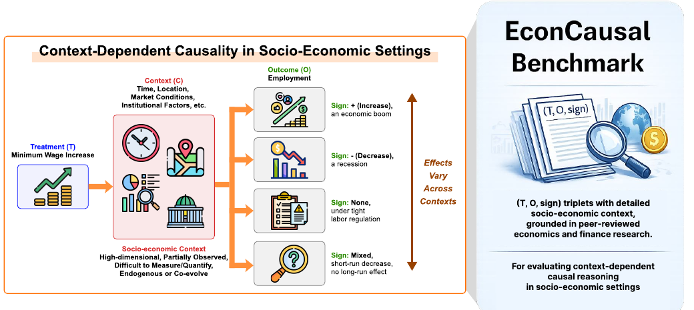

<h1 align="center">EconCausal: A Context-Aware Economic Reasoning Benchmark for Large Language Models</h1>

<p align="center">
  <b>Anonymous Authors</b>
</p>

<p align="center">
  <a href="#license"></a>
</p>

---

## Overview

Socio-economic causal effects depend heavily on their specific institutional and environmental context. A single intervention can produce opposite results depending on regulatory or market factors. This poses a significant challenge for LLMs in decision-support roles: **can they distinguish structural causal mechanisms from surface-level correlations when the context changes?**

**EconCausal** is a large-scale benchmark comprising **10,490 context-annotated causal triplets** extracted from **2,595 high-quality empirical studies** published in top-tier economics and finance journals. Through a rigorous four-stage pipeline combining multi-run consensus, context refinement, and multi-critic filtering, each claim is grounded in peer-reviewed research with explicit identification strategies.

<p align="center">
  
</p>

### Key Findings

- Top models achieve **~88% accuracy** in fixed, explicit contexts
- For closed-source models, Task 2 accuracy drops **32.6 percentage points** on sign-mismatched cases (**73.9% to 41.3%**)
- Under misleading signed evidence (Task 3), closed- and open-source models average only **49.3%** and **44.3%** accuracy, respectively
- Across the four task rows, models achieve only **13.83% accuracy on `None`** and **22.82% on `mixed`**, exposing a substantial gap on non-directional effects

---

## Dataset

### Data Statistics

| Statistic | Value |
|---|---|
| Total causal triplets | 10,490 |
| Source papers | 2,595 |
| Publication years | 1991 -- 2025 |
| Economics journals | 5 (AER, QJE, JPE, ReStud, ECMA) |
| Finance journals | 3 (JFE, JF, RFS) |
| Domain split | Economics 67.7% / Finance 32.3% |

### Data Format

Each causal triplet includes:

| Field | Description |
|---|---|
| `treatment` | Independent variable / intervention |
| `outcome` | Dependent variable / affected endpoint |
| `sign` | Direction of causal effect (`+`, `-`, `None`, `mixed`) |
| `context` | Institutional and environmental context (max 100 words) |
| `identification_methods` | Identification strategies (DiD, IV, RCT, RDD, etc.) |
| Paper metadata | `paper_id`, `title`, `author`, `publication_year`, `published_venue`, `jel_codes`, `paper_url` |

---

## Benchmark Tasks

EconCausal includes three progressively challenging evaluation tasks probing context-dependent causal reasoning.

### Task 1: Causal Sign Prediction (947 econ + 860 finance)

Given a context and a treatment-outcome pair, predict the causal sign. Tests whether LLMs can internalize economic causalities from peer-reviewed research.

### Task 2: Context-Dependent Sign Prediction (284 instances)

Given one known causal effect under context c1, predict the sign of the same treatment-outcome pair under a different context c2. Each released instance contains exactly one reference example, matching the main evaluation input.

### Task 3: Misinformation-Robust Sign Prediction (852 instances)

Same as Task 2, but with one deliberately incorrect signed reference example. Each released instance contains exactly one reference example, matching the main evaluation input.

---

## Repository Structure

```
econcausal-benchmark/
├── data/
│   ├── causal_triplets/        # 10,490 causal triplets (csv + jsonl)
│   ├── tasks/                  # Benchmark tasks (csv + jsonl)
│   │   ├── task1_econ.*        # Task 1 - Economics
│   │   ├── task1_finance.*     # Task 1 - Finance
│   │   ├── task2.*             # Task 2
│   │   └── task3.*             # Task 3
│   └── metadata/               # NBER paper metadata
├── prompts/
│   ├── evaluation/             # Benchmark task prompts (Tasks 1-3)
│   └── pipeline/               # Dataset-construction prompt templates
├── figures/
├── LICENSE
└── README.md
```

---

## Using the Dataset

The benchmark is released as static CSV and JSONL files under `data/`. The exact prompt presented for each benchmark instance is stored in its `question` field, and the expected label is stored in `answer`. Task 2 and Task 3 use exactly one reference example per instance, as in the main evaluation.

This repository intentionally contains dataset artifacts and prompt templates only; API-specific evaluation runners are not included.

---

## License

This dataset is released under the [Creative Commons Attribution-NonCommercial 4.0 International License (CC BY-NC 4.0)](https://creativecommons.org/licenses/by-nc/4.0/).

- The causal triplets and benchmark tasks are derived from peer-reviewed academic papers.
- The source papers are the intellectual property of their respective authors and publishers.
- This dataset is intended for **research purposes only**.

---

## Citation

Citation details will be added after the anonymous review period.

```bibtex
@misc{anonymous2026econcausal,
  title={EconCausal: A Context-Aware Economic Reasoning Benchmark for Large Language Models},
  author={Anonymous Authors},
  year={2026},
  note={Anonymous submission}
}
```

---

## Contact

For questions during review, please use the anonymous review channel.
